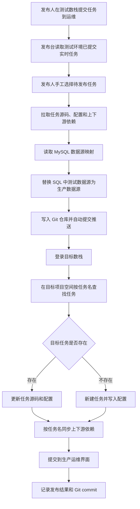

# 数栈实时发布功能实现计划

## 1. 背景与目标

当前目标是建设一个数栈实时任务发布台，用于将测试数栈中已经提交到运维界面的实时任务发布到生产数栈。

发布链路需要满足：

1. 发布人在测试数栈完成任务开发，并提交到测试运维界面。
2. 发布人确认测试任务可发布后，在发布台手工选择一个或多个任务。
3. 发布台拉取任务 SQL 源码、任务配置和上下游依赖配置。
4. 发布台根据 MySQL 中维护的映射关系，将 SQL 中的测试数据源替换为生产数据源。
5. 发布台将正式 SQL 文件写入 Git 仓库，自动提交并推送。
6. 发布台将任务同步到生产数栈目标项目空间。
7. 生产数栈收到更新后的任务，并提交到生产运维界面。
8. 生产任务最终由人工在生产运维界面手动运行。

本阶段只落地文档，不进行代码开发，不串联 API，不连接数据库。

## 2. 当前版本共识

### 2.1 环境边界

- 正式设计按两套数栈处理：测试数栈和生产数栈是不同 IP 或域名。
- 两套数栈的服务版本一致，API 路径和语义应保持一致。
- 开发阶段不直连真实生产数栈，可以在测试数栈中新建一个项目空间模拟生产。
- 后续上线时，理论上只需要切换目标数栈地址、目标项目空间和相关元数据配置。

### 2.2 发布对象

- v1 只处理实时任务。
- v1 只处理 SQL 文件代码管理。
- 发布对象由发布人在 Web 页面中手工选择。
- “已提交任务”以数栈提交任务接口或对应提交任务数据为准，不以开发目录中所有任务为准。

### 2.3 生产任务匹配规则

- 在目标项目空间内，按任务名判断任务是否已经存在。
- 如果目标项目空间内存在同名任务，则更新已有任务。
- 如果目标项目空间内不存在同名任务，则新建任务。
- 任务 ID、目录 ID、项目 ID 不跨环境复用。

### 2.4 依赖与数据源

- v1 必须同步上下游依赖配置。
- 依赖同步时，在目标项目空间内按任务名匹配依赖任务。
- 如果生产环境缺少依赖任务，则发布中止，并输出缺失依赖清单。
- SQL 中测试数据源到生产数据源的替换，依赖 MySQL 元数据中维护的映射关系。
- 如果 SQL 中命中了测试数据源，但缺少生产数据源映射，则发布中止。

### 2.5 Git 管理

- Git 是发布链路中的代码版本管理环节。
- 发布时需要将替换后的正式 SQL 文件写入 Git 仓库。
- 发布台自动生成中文提交信息并推送到目标分支。
- Git 提交成功后，才继续执行生产数栈任务同步。

### 2.6 发布终点

- v1 发布终点是：生产数栈任务已创建或更新，并提交到生产运维界面。
- v1 不自动运行生产任务。
- Jenkins 动态管理任务启动预留到 v2。

## 3. v1 发布链路

### 3.1 链路总览



### 3.2 详细步骤

1. 登录测试数栈，获取可访问测试 API 的 cookie。
2. 登录目标数栈，获取可访问目标 API 的 cookie。
3. 查询测试项目空间中的已提交实时任务。
4. 发布人在 Web 页面中选择待发布任务。
5. 对每个待发布任务执行预检查：
   - 测试任务是否存在。
   - 测试任务是否已提交。
   - 目标项目空间是否存在。
   - Git 仓库和目标分支是否可用。
   - 数据源映射是否完整。
   - 依赖任务在目标项目空间是否存在。
6. 拉取测试任务 SQL 源码、任务配置和上下游依赖配置。
7. 根据 MySQL 映射关系替换 SQL 中的数据源。
8. 将替换后的 SQL 写入 Git 仓库约定路径。
9. 自动生成中文提交信息并推送。
10. 在目标项目空间内按任务名查询生产任务。
11. 如果任务存在，则更新源码和配置。
12. 如果任务不存在，则新建任务并写入源码和配置。
13. 按任务名匹配并保存上下游依赖配置。
14. 提交目标任务到生产运维界面。
15. 写入发布记录，记录每个任务的状态、Git commit 和失败原因。

## 4. 系统模块规划

### 4.1 Web 发布台

- 已提交任务列表页：展示测试环境已提交实时任务，支持手工选择。
- 发布确认页：展示目标环境、目标项目空间、依赖检查、数据源替换检查和 Git 写入信息。
- 发布记录页：展示发布批次、任务状态、Git commit、生产提交状态和失败原因。

### 4.2 数栈 API 客户端

- 复用当前 `demo/login.py` 已验证的模拟登录能力。
- 后续开发时封装统一客户端，但每个 API 允许单独配置请求头、请求参数和请求体。
- cookie 失效后需要自动重新登录。
- 当前阶段不验证后续 API，等 API 细节补齐后再开发。

### 4.3 发布编排服务

- 编排任务查询、预检查、源码拉取、数据源替换、Git 写入、生产 upsert、依赖同步和提交运维。
- 任一步失败即中止当前任务发布，并记录失败原因。
- 批量发布时，失败策略默认先中止当前批次；是否支持其他任务继续发布，待后续确认。

### 4.4 Git 管理服务

- 负责 SQL 文件落盘、差异检查、中文提交和推送。
- 建议默认路径：

```text
tasks/<目标环境>/<目标项目空间>/<任务名>.sql
```

- 文件名需要处理特殊字符，具体转义规则待后续实现时确认。

### 4.5 MySQL 元数据服务

- 维护环境、项目空间映射、数据源映射和发布记录。
- Web demo 已提供只读接入层：配置 `DATABASE_URL` 后直接读取 MySQL；演示数据通过 `scripts/seed_demo_data.py` 写入 MySQL，不再从应用代码回退 mock 数据。
- DDL 由你手动执行，应用不自动建表或迁移。

### 4.6 登录鉴权服务

- Web 登录使用生产数栈账号、前端 SM2 加密后的密码密文和验证码换取生产 Cookie，密文规则为 `04 + sm2.doEncrypt(password, publicKey, 0)`。
- 浏览器 Form Data 只提交 `password_ciphertext`，不提交明文 `password`。
- 验证码请求产生的临时 Cookie 由后端按验证码 `key` 短暂缓存，登录提交时复用同一生产会话。
- 当前阶段暂不调用登录后二次验证接口，只按 `dt_token` 与 `DT_SESSION_ID` 判断登录成功。
- 生产 Cookie 加密存入 `rc_auth_session`，浏览器仅保存本系统 `rc_session`。
- 未登录访问业务页面返回权限页，避免直接进入发布台。

## 5. MySQL 元数据规划

> 本节为后续实现前的字段草案，最终字段以你提供的信息为准。

### 5.1 环境配置

| 字段 | 用途 | 示例 | 是否必填 | 当前状态 |
| --- | --- | --- | --- | --- |
| 环境编码 | 区分测试、生产 | `test` / `prod` | 是 | 待提供 |
| 环境名称 | 页面展示名称 | `测试数栈` | 是 | 待提供 |
| 数栈地址 | API base_url |  | 是 | 待提供 |
| 登录账号标识 | 关联登录账号或凭据配置 |  | 是 | 待提供 |
| 是否启用 | 控制环境是否可选 |  | 是 | 待提供 |

### 5.2 项目空间映射

| 字段 | 用途 | 示例 | 是否必填 | 当前状态 |
| --- | --- | --- | --- | --- |
| 源环境 | 测试环境编码 | `test` | 是 | 待提供 |
| 源项目空间名称 | 测试项目空间名称 |  | 是 | 待提供 |
| 源项目空间 ID | 测试项目空间 ID |  | 是 | 待提供 |
| 目标环境 | 生产环境编码 | `prod` | 是 | 待提供 |
| 目标项目空间名称 | 目标项目空间名称 |  | 是 | 待提供 |
| 目标项目空间 ID | 目标项目空间 ID |  | 是 | 待提供 |
| 目标任务开发目录 ID | 目标环境任务开发根目录 ID |  | 是 | 待提供 |

### 5.3 数据源映射

| 字段 | 用途 | 示例 | 是否必填 | 当前状态 |
| --- | --- | --- | --- | --- |
| 适用项目空间 | 限定映射适用范围 |  | 是 | 待提供 |
| 测试数据源文本 | SQL 中需要被替换的测试数据源 |  | 是 | 待提供 |
| 生产数据源文本 | 替换后的生产数据源 |  | 是 | 待提供 |
| 替换说明 | 说明替换原因或注意事项 |  | 否 | 待提供 |
| 是否启用 | 控制映射是否生效 |  | 是 | 待提供 |

### 5.4 发布记录

| 字段 | 用途 | 示例 | 是否必填 | 当前状态 |
| --- | --- | --- | --- | --- |
| 发布批次 ID | 串联一次发布中的多个任务 |  | 是 | 待提供 |
| 任务名 | 发布任务名称 |  | 是 | 待提供 |
| 源环境和项目 | 记录任务来源 |  | 是 | 待提供 |
| 目标环境和项目 | 记录发布目标 |  | 是 | 待提供 |
| 发布状态 | 成功、失败、处理中 |  | 是 | 待提供 |
| Git commit | 对应 Git 提交 |  | 是 | 待提供 |
| 失败原因 | 失败时记录原因 |  | 否 | 待提供 |
| 创建时间 | 发布发起时间 |  | 是 | 待提供 |
| 完成时间 | 发布完成时间 |  | 否 | 待提供 |

## 6. API 清单

### 6.1 已有线索

| API 功能 | 地址 | 方法 | 说明 | 当前状态 |
| --- | --- | --- | --- | --- |
| 获取实时项目空间 | `/api/streamapp/service/project/getAllProjects` | POST | 获取实时项目空间列表 | 已在 Notion 记录，需要补齐请求头要求 |
| 获取实时任务开发目录 | `/api/streamapp/service/streamCatalogue/getCatalogue` | POST | 获取任务开发目录及文件节点 | 已在 Notion 记录，需要确认参数 |
| 创建实时任务开发文件夹 | `/api/streamapp/service/streamCatalogue/addCatalogue` | POST | 创建任务开发目录 | 已在 Notion 记录，需要确认是否 v1 必需 |

### 6.2 待补齐 API

| API 功能 | 地址 | 方法 | 请求头 | 请求参数/Body | 响应关键字段 | 是否必填 | 当前状态 |
| --- | --- | --- | --- | --- | --- | --- | --- |
| 登录接口 |  |  |  |  |  | 是 | 待提供或沿用 `demo/login.py` |
| 已提交任务查询 API |  |  |  |  |  | 是 | 待提供 |
| 任务源码查询 API |  |  |  |  |  | 是 | 待提供 |
| 任务配置查询 API |  |  |  |  |  | 是 | 待提供 |
| 任务创建 API |  |  |  |  |  | 是 | 待提供 |
| 任务更新 API |  |  |  |  |  | 是 | 待提供 |
| 依赖查询 API |  |  |  |  |  | 是 | 待提供 |
| 依赖保存 API |  |  |  |  |  | 是 | 待提供 |
| 提交到运维 API |  |  |  |  |  | 是 | 待提供 |

## 7. 失败策略

- 登录失败：中止发布，提示对应环境登录失败。
- 已提交任务查询失败：中止发布，提示任务来源不可用。
- 任务源码或配置缺失：中止发布，记录缺失任务信息。
- 数据源映射缺失：中止发布，记录缺失映射项。
- 生产依赖任务缺失：中止发布，输出缺失依赖任务名。
- Git 提交或推送失败：中止发布，不继续更新生产数栈。
- 生产任务创建或更新失败：中止发布，记录 API 响应。
- 依赖保存失败：中止发布，记录已更新任务和失败原因。
- 提交生产运维失败：中止发布，记录任务已创建或更新但未提交。
- v1 不做自动回滚。

## 8. 待你提供内容

| 内容 | 用途 | 示例 | 是否必填 | 当前状态 |
| --- | --- | --- | --- | --- |
| 测试数栈地址 | 访问测试数栈 API |  | 是 | 待提供 |
| 生产数栈地址 | 访问生产数栈 API |  | 是 | 待提供 |
| 开发阶段模拟生产项目空间 | 在测试数栈中模拟生产发布 |  | 是 | 待提供 |
| 登录账号/密钥获取方式 | 支持测试和生产登录 |  | 是 | 待提供 |
| Git 仓库地址 | 存储正式 SQL 文件 |  | 是 | 待提供 |
| Git 目标分支 | 发布写入分支 |  | 是 | 待提供 |
| MySQL 地址、库名、账号获取方式 | 存储元数据和发布记录 |  | 是 | 待提供 |
| 项目空间映射字段 | 维护测试到生产项目映射 |  | 是 | 待提供 |
| 数据源映射字段 | 支持 SQL 数据源替换 |  | 是 | 待提供 |
| 已提交任务查询 API | 获取测试已提交任务 |  | 是 | 待提供 |
| 任务源码查询 API | 获取 SQL 源码 |  | 是 | 待提供 |
| 任务配置查询 API | 获取任务配置 |  | 是 | 待提供 |
| 任务创建 API | 生产不存在任务时新建 |  | 是 | 待提供 |
| 任务更新 API | 生产存在任务时更新 |  | 是 | 待提供 |
| 依赖查询 API | 获取上下游依赖 |  | 是 | 待提供 |
| 依赖保存 API | 写入生产依赖配置 |  | 是 | 待提供 |
| 提交到运维 API | 将生产任务提交到运维界面 |  | 是 | 待提供 |
| 发布记录需要展示的字段 | 确认监控页面展示信息 |  | 是 | 待提供 |

## 9. 后续代码实现前置条件

进入代码开发前，需要满足：

1. 测试数栈、生产数栈或模拟生产空间信息已经补齐。
2. Git 仓库地址和目标分支已经确定。
3. MySQL 元数据库连接信息和字段设计已经确认。
4. 已提交任务、源码查询、创建、更新、依赖查询、依赖保存、提交运维等 API 已经补齐。
5. 每个 API 的请求头、请求参数、请求体和响应关键字段已经确认。
6. 数据源替换映射样例已经提供。
7. 发布记录页面需要展示的字段已经确认。

在这些信息补齐前，只维护文档，不进入代码执行。

## 10. 验收标准

- 本地存在完整计划文档，且所有待补内容都明确标注。
- README 有文档入口，但不承载大量计划正文。
- Notion 原页面保留需求总览，并追加当前共识和实现计划链接。
- Notion 子页面包含完整实现计划。
- 本阶段没有任何代码开发、数据库连接或 API 调用验证行为。
